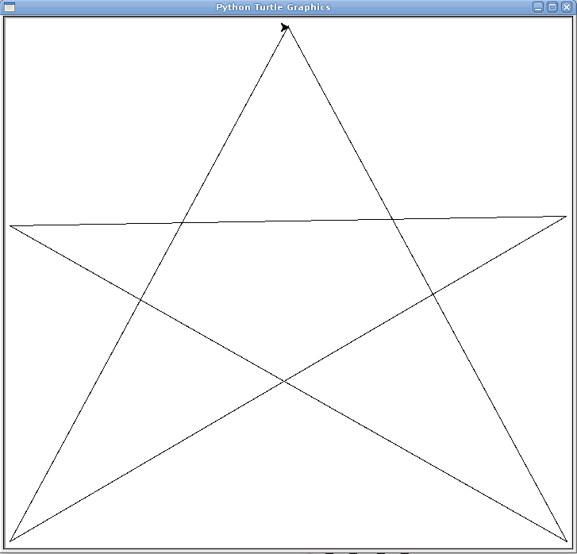
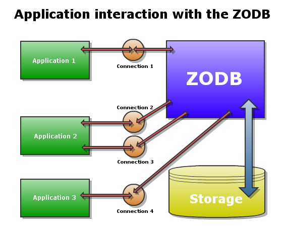

==========================
Our First ZODB Application
==========================

Now that we know a little about what the ZODB offers, let's see how to install
it and use it. This chapter shows where and how to get the ZODB running with
your Python installation and explains some basic concepts about the way that
applications interact with the ZODB. Along the way, we'll create a simple ZODB
application that stores a line drawing in the database.

Installing the ZODB from PyPI
=============================

The Python Package Index (PyPI) is a repository of software for Python, where
thousands of packages are available for download.

What makes PyPI much more powerful is a Python script called easy_install —a
script that allows Python developers to install any package indexed on the PyPI
over the network, keeping track of dependencies and versions. Packages that can
be easy installed are packaged either as compressed files or in a special
format, using the .egg extension, and are known as Python eggs.

The easy_install module is a part of a package known as setuptools, so we need
need to install that in order to obtain it. There's an installer for Windows
and a .egg file for Unix/Linux/Mac available at the setuptools PyPI page on
http://pypi.python.org/pypi/setuptools.

To install setuptools on Windows, just run the installer. For Unix/Linux/Mac
systems, run the .egg file as a shell script, like in this example (yourxi
version may vary)::

    $ sh setuptools-0.6c11-py2.4.egg

Many Linux distributions include a package for setuptools. In Ubuntu or Debian,
for example, you can use apt-get to install it::

    $ sudo apt-get install python-setuptools

However, we recommend that you install the newest version manually, even if
there's a package available for your system, as this way you are assured of
getting the latest version.

After this, the easy_install script will be available on the system Python's
path, and the ZODB can be installed on your system using::

    $ sudo easy_install ZODB3

Note that the package name is 'ZODB3', not just ZODB. The package and its few
dependencies will be downloaded and installed.  Before going any further, make
sure that you can import the package using the Python interpreter::

    $ python
    >>> import ZODB

The line drawing application
============================

We are ready to try out the ZODB for the first time. We'll do that by writing a
small application and then adapting it to store some data using the ZODB.

One cool thing about Python is the huge number of packages available in the
standard library. Let's use one of those to create a simple application to
draw lines with the mouse on a canvas. All that you need is to have a full
Python installation, including the Tkinter graphical toolkit. Windows and Mac
OSX users should have no problem, but some linux distributions, like Ubuntu,
require the python-tk package to be installed separately.

Here's the code for our application:

.. literalinclude:: ../code/installing/turtle_paint.py
    :linenos:

The turtle module provides graphics commands to move a turtle around a Tk
canvas and draw dots along the way if the turtle's pen is "down". The module
includes methods to listen to events like clicks and key presses, which we use
here to create a small interactive demo.

The code is fairly simple. When the program is run from the command line, the
initialization routine is called on line 21 and then control is transferred to
the Tk main loop to capture events and show the canvas window. The init method
on lines 13-18 binds the events for mouse buttons and key presses to a couple
of functions in our code and starts the listening process.

When the left mouse button is pressed, the goto function that is part of the
turtle module is called. Tk events send mouse coordinates, which is precisely
what goto needs, so the function can be bound directly to the event. The goto
function moves the turtle to the specified coordinates, drawing a line as it
goes if the pen is down, as it is at the start of the program.

The right mouse button click event is bound to the switchupdown function on
line 3, which toggles the up/down status of the pen. In addition, the 'c' key
causes the clear function to be called to clear the screen and reinitialize the
event bindings. Finally, the 'q' key calls the quit function, which just exits
the program using the bye function from the turtle module.

The following image shows the program in action:

Saving drawings on the ZODB
===========================

Our overly simple drawing program works, though it would be nice if we could
save our drawings to disk. Neither Tk nor turtle offer facilities for storing
a drawing on disk and keep working on it later, which is what we'd like to do,
so we decide to use the ZODB.

Turtle does not have a representation of the drawing that we can save, but it
does have an undo buffer that stores every drawing command. Undo information
is not kept inside a basic Python data structure. Instead, the turtle module
has a Tbuffer class that allows pushing and popping drawing commands from it.

With most databases, storing the information from this buffer would require
decomposing the Tbuffer instance into a compatible database representation,
like table definitions. When reading the data back into the application, it
would be necessary to create an instance of the Tbuffer class and manually set
all its attributes to the stored values.

We mentioned in the introduction that the ZODB is mostly transparent and works
with live Python objects. We also said that it's simple to use. Time to put
those claims to the test.

Setting up a connection
-----------------------

The ZODB architecture defines a few concepts with which we need to be familiar
before using it:

* A *storage* takes care of the low level details for handling the storage
  and retrieval of objects from some kind of store. By far the most used
  storage available for the ZODB is the FileStorage, which stores objects on
  a single file in the computer's file system. There are other kinds of
  storages, like RelStorage and DirectoryStorage, which store objects in a
  relational database and on multiple directories on a file system,
  respectively.
 
* A *database* is basically a process that handles a pool of connections. It
  is implemented by the DB class in the ZODB package.

* A *connection* provides access to the objects inside the database and takes
  care of caching them for faster access. A multi-threaded application can
  open one connection per thread and each connection will have its own cache
  and will be able to modify objects independently of the other threads.

* The *root* object of the database can be accessed through a connection and
  acts like a Python dictionary. Simple applications may not need anything
  more than this object to store their data. More complex applications can
  store complete hierarchies of containers and the ZODB package includes data
  structures specifically tailored to this task.

Thus, to connect to the ZODB a storage has to be opened and passed to a DB
instance, which can handle one or more connections from the application. The
following diagram illustrates this interactions:

For our drawing application, we'll use the default FileStorage, which takes a
path to the database file as an initialization parameter. Let's add the
following lines to the start of our turtle drawing program:

.. code-block:: python
    :linenos:

    import transaction
    from ZODB import DB, FileStorage

    storage = FileStorage.FileStorage('drawing.fs')
    db = DB(storage)
    connection = db.open()
    drawing = connection.root()

First we make a couple of imports. DB and FileStorage must be self-explanatory
after the concepts that we have just discussed. The transaction module will be
explained later.

On line 4 we create a FileStorage with the relative path 'drawing.fs'. This
means that, if it does not exist, a file named drawing.fs will be created on
the same directory as the program. If the path exists the database will append
data to it. The filename used for the database can have any name that we
choose. Usually the extension .fs is used, but it is by no means required.

Line 5 initializes the database using the storage that we just opened. Line 6
then opens a connection to this database. Finally, the root method of the
connection instance is used to obtain the root object of the database. We are
ready to start storing objects in there.

Storing the drawing on the ZODB
-------------------------------

Earlier on, we had decided to store the undo buffer object on the database.
Remember, the root object acts like a dictionary. To keep thing simple for
now, let's just put the complete contents of the buffer under the key
'turtle_buffer' on the root. We'll do this only when the user decides to quit
the application. The quit function will now look like this:

.. code-block:: python
    :linenos:

    def quit():
        drawing['turtle_buffer'] = getturtle().undobuffer
        transaction.commit()
        bye()

Just before quitting, the program gets the undobuffer from the current turtle
object and assigns it to the aforementioned turtle_buffer key of the drawing
object, which represents the database root.

At this point the value of the turtle_buffer key will be the whole undobuffer,
but the change will not be made permanent on the database until we commit the
transaction. Between the time that we change something on the database and we
commit the transaction, all the code in this thread will see the new value
while other threads continue to work with the old.

In this case we commit the change immediately and exit the program. The full
sequence of steps used to create the drawing that was on the screen will have
been saved inside the ZODB.

The next step is to check if the turtle_buffer key exists in the root object
at program start time, and if it does we can use its value to redraw the saved
drawing. A couple of lines in the startup code will make this check:

.. code-block:: python
    :linenos:

    if __name__ == "__main__":
        if 'turtle_buffer' in drawing:
            redraw(drawing['turtle_buffer'])
        init()
        mainloop()

All we need to do now is to repeat the undo steps in reverse order to get the
saved drawing on the canvas. The redraw function takes advantage of some
knowledge of the internal structure of the buffer to do this, but is otherwise
straightforward. The final program with this function added looks like this:

.. literalinclude:: ../code/installing/turtle_paint_zodb.py
    :linenos:

That's it. Other than the transaction commit call, the code for storing the
whole data structure for the buffer inside the ZODB is this::

    drawing['turtle_buffer'] = getturtle().undobuffer

That's what we meant when we said that storing Python objects inside the ZODB
is nearly transparent.

Why not just use pickle?
========================

Some readers may be tempted to say that everything that we did above could
just as easily have been done using the pickle module from the standard
library.

They would be right, of course, since in the first place this was a very
simple application and in the second place the ZODB uses pickle itself.
However, this view misses the larger picture of the extra features that the
ZODB offers beyond the simple serialization of objects and the huge difference
this makes when working with larger and more complex applications.

Later sections of this book will elaborate a lot more on this topic, but for
now let's finish the chapter by showing off one of these features, enabled by
the transactional nature of the ZODB: the ability to undo transactions.

Undoing a transaction
---------------------

Each time the user quits the drawing application, a transaction is committed
that saves the current drawing inside the ZODB. The FileStorage storage that
we use for this application supports history and undoing of transactions, so
we could get back to any previous drawing if we needed to.

The current application has no support for this feature, but it's very easy to
use the Python interactive interpreter to talk directly to the database and
perform the undofrom there.

First, be sure to create at least a couple of drawings and remember the
differences between the last two. For example, suppose that you drew a square
and then quit the application, cleared the screen and drew a star. If you quit
and restart the application now, you'll see the star. Quit again, then fire the
Python interpreter::

    $ python
    >>> from ZODB import DB, FileStorage
    >>> storage = FileStorage.FileStorage('drawing.fs')
    >>> db = DB(storage)

We did the same imports that we have in our code and got a handle to the
database. That's all we need to use undo. The undoInfo method of the database
gives us all the transactions that we have made::

    >>> db.undoInfo()
    [{'description': '', 'size': 3929, 'user_name': '', 'id': 'A4jb//pPmRE=',
      'time': 1284435838.6666241},
     {'description': '', 'size': 3185, 'user_name': '', 'id': 'A4jb0VC8hMw=',
      'time': 1284433038.9225941},
     {'description': '', 'size': 4211, 'user_name': '', 'id': 'A4jLhw8D0qo=',
      'time': 1284182823.519125},
     {'description': '', 'size': 3376, 'user_name': '', 'id': 'A4jLhk2BBVU=',
      'time': 1284182778.1649971}]

This method gives us some interesting information for each transaction, like
transaction size and time. In this case we are interested in the transaction
id, since this is what the undo method requires to do its job::

    >>> last_transaction = db.undoInfo()[0]
    >>> db.undo(last_transaction['id'])
    >>> import transaction
    >>> transaction.commit()

The undo method of the database takes a transaction id and undoes the
specified transaction. Notice that the undo operation is in itself a
transaction and as such must be commited and can be undone as well. In this
example, we undid the very last transaction (undoInfo shows transactions in
inverse order).

If you close the interpreter session now and start the turtle application once
more, the star drawing will be gone and the square will be shown on the canvas
again.

Summary
=======

In this chapter we covered how to install the ZODB package and created a very
simple drawing application which stores the drawings on the ZODB.  Of course,
we have just scratched the surface of what the ZODB can do.  Hopefully, you see
the potential by now. In the next chapter we'll create a more realistic
application and explain in detail how to work with the ZODB.

